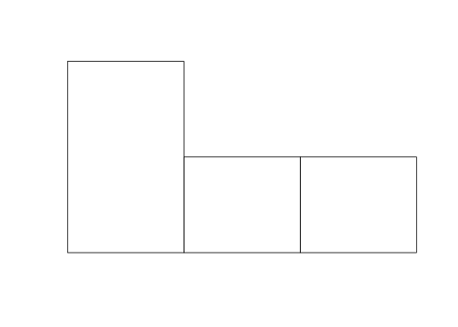

# knitr gridSVG
Bastiaan Quast  
28 September 2017  


# Base Plot


```r
hist(1:4, xaxt='n', yaxt='n', ann=FALSE)
```

<!-- -->

# ggplot2


```r
# opts_chunk$set(dev = 'gridSVG::gridsvg')
library(ggplot2)
qplot(1:4) + theme_classic()
```

```
## `stat_bin()` using `bins = 30`. Pick better value with `binwidth`.
```

<!-- -->
